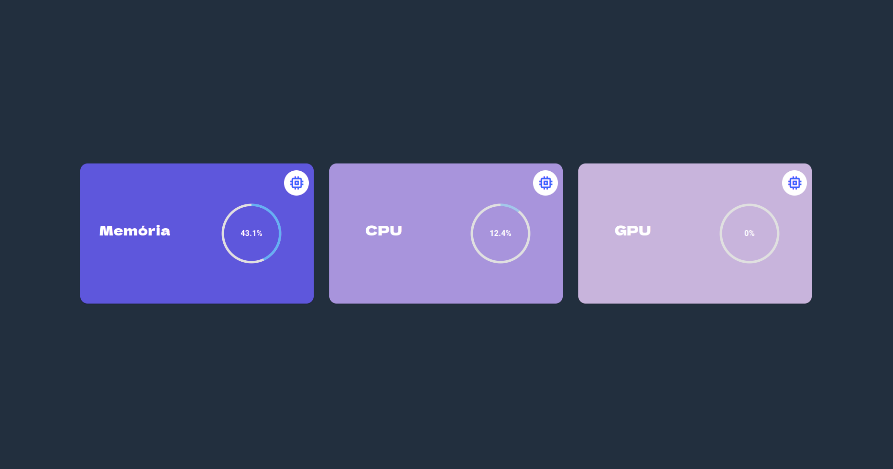

# Real Time Monitoring

## Descrição
<strong>Real Time Monitoring</strong> é um sistema que captura os dados de Memória, CPU e GPU do dispositivo em tempo real, utilizando SSE (Server-Sent Events).

## Integrantes

<table align="center">
  <tr>
    <td align="center">
      <a href="https://www.linkedin.com/in/rocha-caio/">
        <br>
        <sub>
          <b>Caio Rocha</b>
        </sub>
      </a>
    </td>
    <td align="center">
      <a href="https://www.linkedin.com/in/jo%C3%A3o-jacinto-a927301b2/">
        <br>
        <sub>
          <b>João Jacinto</b>
        </sub>
      </a>
    </td>
    <td align="center">
      <a href="https://www.linkedin.com/in/sallyscarlos/">
        <br>
        <sub>
          <b>Sallys Carlos</b>
        </sub>
      </a>
    </td>
  </tr>
</table>

## Tecnologias utilizadas

<ul>
  <li>Flask</li>
  <li>Angular</li>
</ul>

<br>

## Pré-requisitos

Antes de executar a aplicação, atente-se aos requisitos:
* Ter instalada a versão mais recente do `<Node.js>`, `Angular`, `<Flask>`, `<psutil>`, `<GPUtil>` e `<Cors>`

<br>

## Executando o Projeto

Para executar o projeto, basta seguir as seguintes etapas:

1. Instalar os requisitos acima:

<ul>
  <li>
    <strong>Node.js</strong>
    <p>Acesse <a href="https://nodejs.org/en">https://nodejs.org/en</a> e siga as instruções necessárias.</p>
  </li>

  <li>
    <strong>Angular</strong>
    <p>Com o Node.js instalado, execute o seguinte comando para instalar o Angular: <strong>npm install -g @angular/cli</strong></p>
  </li>

  <li>
    <strong>Flask, psutil, GPUtil e Cors</strong>
    <p>Basta executar o seguinte comando: <strong>pip install flask psutil gputil cors</strong></p>
  </li>
</ul>

2. Fazer o clone do projeto:<br>
```
>> git clone https://github.com/scsSilva/Real-Time-Monitoring.git
```

<br>
3. Instalar os pacotes do frontend (Angular):<br><br>

```
>> npm install
```
<br>

4. Executar o servidor e o frontend:<br><br>
Abra dois terminais. No primeiro, você irá executar o comando <strong>python3 index.py</strong> para rodar o servidor. Já no outro, execute <strong>ng serve</strong> para rodar o frontend.

Pronto! Basta abrir no navegador a url exibida pelo ng serve.

## PREVIEW


<br /><br />
